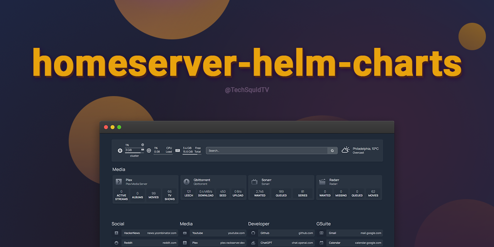

<p align="center">
  
</p>

<p align="center">
  A personal collection of helm charts for the ultimate home server.
</p>

## Services

- 🌐 [`nginx`](https://hub.docker.com/_/nginx): A high-performance web server and reverse proxy.
- 🏠 [`homepage`](https://gethomepage.dev/): A customizable start page for your home server.
- 📺 [`plex`](https://www.plex.tv/): A personal media server.
- 🎬 [`radarr`](https://radarr.video/): An automated movie download and management system.
- 📰 [`sabnzbd`](https://sabnzbd.org/): The automated Usenet download tool.
- 📺 [`sonarr`](https://sonarr.tv/): An automated TV show download and management system.
- 👁️ [`overseerr`](https://overseerr.dev/): A request management and media discovery tool.
- 🔍 [`jackett`](https://github.com/Jackett/Jackett): An API to connect with various torrent providers.
- ⏬ [`qbittorrent`](https://www.qbittorrent.org/): A lightweight and feature-rich torrent client.
- 🦅 [`huginn`](https://github.com/huginn/huginn): Create agents that monitor and act on your behalf.
- 💬 [`thelounge`](https://thelounge.chat/): A modern, self-hosted web IRC client.
- 🤖 [`autobrr`](https://autobrr.com/): Automatically search and download from IRC.
- 📊 [`tautulli`](https://tautulli.com/): Monitor your Plex Media Server.
- ☁️ [`cloudflared`](https://developers.cloudflare.com/cloudflare-one/connections/connect-apps/install-and-setup/installation/): Expose services running on your home network to the internet.
- 📲 [`gotify`](https://gotify.net/docs/plugin): Self-hosted push notifications.
- 📲 [`apprise-api](https://github.com/caronc/apprise-api): Multi-platform push notifications.
- 🔄 [`changedetection.io`](https://changedetection.io): Monitor web pages for changes.
- 🌐 [`selenium/standalone-chrome`](https://hub.docker.com/r/selenium/standalone-chrome): Pre-configured with Chrome & Selenium for browser testing. 

## Prerequisites

- Kubernetes 1.16+ (built for k3s)
- Helm 3.0+

## Installing the Repository

To add this repository to your Helm client, run the following command:

```bash
helm repo add home-server https://github.com/KyleTryon/homeserver-helm-charts
```

## Installing Charts

To install a chart from this repository, use the following command:

```bash
helm install [RELEASE_NAME] home-server/[CHART_NAME]
```
