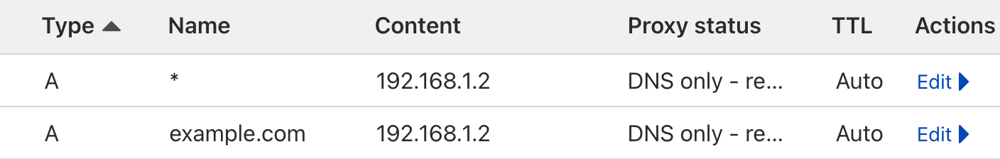

# Getting Started

Configure the ultimate home server with [K3s](https://k3s.io/) and [Helm](https://helm.sh/).

## Prerequisites

- Ubuntu 20.04 (or newer) server
- A domain name
- Basic knowledge of Linux commands

### Recommended Hardware (_to run all services_)
- **CPU**: 8+ cores
- **RAM**: 32+ GB

Running only a few services should work on a Raspberry Pi 4 with 4 GB of RAM.

## Setup your server

In a freshly installed Ubuntu 20.04 (or newer) server, begin by ensuring your system is up to date:

```bash
sudo apt update && sudo apt upgrade -y
```

Install some useful tools:

```bash
sudo apt install -y curl git gettext-base nano 
```

### RAID storage

If you plan on configuring a RAID array for your storage, you may want to do this now. We recommend using ZFS to create a RAIDZ1 array with at least 3 disks. See [this guide](https://ubuntu.com/tutorials/setup-zfs-storage-pool#1-overview).

### Install K3s

[k3s](https://k3s.io/) is a lightweight Kubernetes distribution. It's a great choice for our home server because it has a small resource footprint, supports single-node clusters, and supports mounting a local path as a persistent volume.

```bash
curl -sfL https://get.k3s.io | sh -
```

### Install Helm

[Helm](https://helm.sh/) is a package manager for Kubernetes. It allows us to easily install and manage applications on our cluster.

```bash
curl -fsSL -o get_helm.sh https://raw.githubusercontent.com/helm/helm/main/scripts/get-helm-3
```

```bash
chmod 700 get_helm.sh
```

```bash
./get_helm.sh
```

### Clone this repository

```bash
git clone https://github.com/TechSquidTV/UltimateHomeServer /opt/homeserver
```

## Configure a domain name

We will use a domain to access our server locally with a valid SSL certificate.

Before we begin, we will need to know the local IP address of our server. We can find this by running:

```bash
ip addr
```

You should configure your router to assign a static IP address to your server if you have not already.

1. Once you have your server's IP address, you can configure a domain name. You can obtain a domain name from a registrar of your choice.
2. In the DNS settings for your domain, create an `A` record that points to your server's IP address.
3. Create a second `A` record that points to your server's IP address, but with a subdomain of `*.`, this will be used for wildcard subdomains.

[](../.github/img/dns_records.png)

## Configure SSL

Read the [SSL](SSL.md) guide for instructions on how to configure SSL for your domain using certbot. This step is _required_.

## Customize services

Read the [Customize](Customize.md) guide for instructions on how to customize the services you want to deploy.

## Deploy services

Once you have configured your server, domain with ssl, and customized the services you want to deploy, you can create the helm deployment.

To make it easier to load your environment variables from the `.env` file, the deployment and update commands have been wrapped in scripts. You can run the deployment script with:

```bash
./bin/deploy.sh <your domain>
```

## Verify services

Read the [Troubleshooting](Troubleshooting.md) guide for instructions on how to verify that the services are running correctly.

## Update services

To update the services, you can run the update script with:

```bash
./bin/upgrade.sh <your domain>
```
